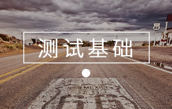
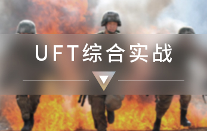
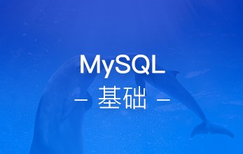
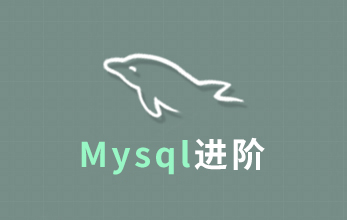
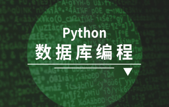
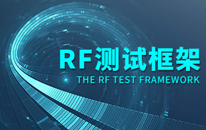

#软件测试

  在国内软件测试发展的初期，测试工作作为一个辅助性工作，并不像如今这么专业、规范，很多时候基本都是靠软件测试工程师自己的经验，依据需求规格说明书开展软件测试活动，这种情况下测试覆盖率及正确性基本都是靠软件测试工程师个人职业素质，盲目测试、漏测风险大大增加。随着软件工程学科发展及用户对产品质量需求的不断增加，在ISO、CMMI等软件质量标准中都要求软件测试活动实施时必须进行测试用例设计，以期降低软件质量风险，提高软件测试活动质量。本套教程就是基于此进行设计的，全面讲解最新软件测试相关技术。

## 第一阶段：系统测试模块

  在软件测试行业，如何设计高效简洁的测试用例，是目前软件测试工程师普遍关注的问题，本阶段着重剖析测试用例格式及常见的等价类、边界值、判定表、因果图、正交试验、状态迁移等设计方法，帮助软件测试工程师掌握测试用例设计技能，更高效的完成软件测试的设计工作。

]

### [测试基础](http://www.maiziedu.com/course/442/)

]

### [系统测试流程](http://www.maiziedu.com/course/445/)

]

### [测试用例设计](http://www.maiziedu.com/course/446/)

]

### [测试管理](http://www.maiziedu.com/course/447/)

]

### [缺陷管理](http://www.maiziedu.com/course/465/)

## 第二阶段：WEB测试模块

  在网站架构上，WEB系统的B/S架构由于其灵活的适配和标准化等特点，越来越受到企业架构师的亲睐，在移动互联网时代，WEB系统架构更加大受欢迎。本课程将专门针对WEB系统的软件测试技术和原理进行深入讲解，包括从WEB系统架构，网络协议到安全性测试，前端测试，可用性及兼容性测试等软件测试领域均有详细讲解，并结合实战演练和案例演示，彻底解开WEB系统的神秘面纱。

]

### [WEB系统基础](http://www.maiziedu.com/course/427/)

]

### [理解网络协议](http://www.maiziedu.com/course/428/)

已更新：8章

]

### [HTTP协议详解](http://www.maiziedu.com/course/429/)

]

### [WEB前端分析](http://www.maiziedu.com/course/438/)

]

### [WEB安全性测试](http://www.maiziedu.com/course/439/)

]

### [WEB兼容性及可用性测试](http://www.maiziedu.com/course/440/)

## 第三阶段：UFT与Selenium自动化测试

  软件测试技术已从黑盒测试、白盒测试，发展到了自动化测试，本阶段将由麦子学院带你详细了解自动化测试的基础知识、框架设计、UFT高级测试开发及实战等几个方面的内容，全面掌握自动化测试相关技术要点和操作。

]

### [自动化测试基础](http://www.maiziedu.com/course/448/)

]

### [UFT自动化测试详解](http://www.maiziedu.com/course/449/)

]

### [UFT高级测试开发](http://www.maiziedu.com/course/450/)

]

### [自动化测试框架设计](http://www.maiziedu.com/course/451/)

]

### [UFT综合实战](http://www.maiziedu.com/course/452/)

]

### [自动化测试-selenium](http://www.maiziedu.com/course/568/)

## 第四阶段：LR性能测试

  按照整个软件测试流程，性能测试是需要重点测试的地方，通过本阶段性能测试核心技术、性能测试脚本开发、LR性能测试场景设计、LR指标分析等课程的学习，可很好的掌握性能测试相关技术要点和操作，能实现独立完成从性能测试设计到指标分析的一系列软件测试操作。

]

### [性能测试核心技术](http://www.maiziedu.com/course/433/)

]

### [性能测试脚本开发](http://www.maiziedu.com/course/434/)

]

### [LR场景设计](http://www.maiziedu.com/course/435/)

]

### [LR指标分析](http://www.maiziedu.com/course/436/)

## 第五阶段：软件测试拓展

  软件测试拓展

]

### [Windows Phone 8数据库操作及数据加密](http://www.maiziedu.com/course/188/)

]

### [Mysql基础](http://www.maiziedu.com/course/306/)

]

### [Mysql进阶](http://www.maiziedu.com/course/335/)

]

### [Python 数据库编程](http://www.maiziedu.com/course/573/)

]

### [Linux操作系统基础（最新版）](http://www.maiziedu.com/course/588/)

]

### [Linux SHELL编程与实践](http://www.maiziedu.com/course/529/)

]

### [单元测试](http://www.maiziedu.com/course/661/)

## 第六阶段：项目实战

  项目阶段

]

### [web测试项目实战](http://www.maiziedu.com/course/696/)

]

### [RF测试框架](http://www.maiziedu.com/course/917/)
